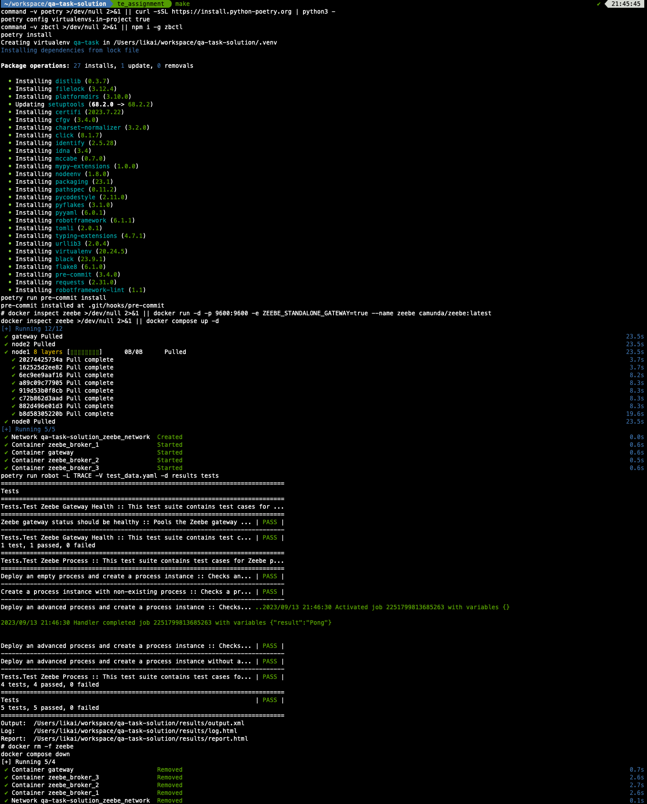

## Introduction

The SUT [Zeebe](https://docs.camunda.io/docs/components/zeebe/zeebe-overview/) is the process automation engine powering [Camunda 8](https://camunda.com/).

The Zeebe cluster is deployed with [docker-compose](./docker-compose.yaml), resulting in a standalone gateway and 3 brokers. The gateway ports `9600` and `26500` are exposed to the host machine.

The easiest test case is to check the gateway status, which can be done with a simple HTTP GET request to the [gateway health endpoint](https://docs.camunda.io/docs/self-managed/zeebe-deployment/configuration/gateway-health-probes/). The caveat is that the gateway health endpoint has different response for embedded and standalone gateway. The embedded gateway is used by default, and the standalone gateway can be enabled by setting the `ZEEBE_STANDALONE_GATEWAY` environment variable to `true`. But the health status is not `UP` until other brokers are connected to the gateway.

Following that, processes are also tested, including process deployment and process instance creation. Zeebe client [zbctl](https://docs.camunda.io/docs/apis-tools/cli-client/cli-get-started/) is used to interact with the Zeebe cluster, since it's well maintained and easy to use, compared to the Python clients. Of course, [Zeebe gRPC API](https://docs.camunda.io/docs/apis-tools/grpc/) can also be used, but it requires more effort to implement the client.

The worker is also tested, which is created and running in the background. The worker is terminated after the test cases are executed, by maintaining a list of worker subprocesses.

As examples, The following test cases are implemented in this projects:

- Zeebe gateway status should be healthy
- Deploy an empty process and create a process instance
- Create a process instance with non-existing process
- Deploy an advanced process and create a process instance
- Deploy an advanced process and create a process instance without a worker

More details can be found in the [test_zeebe.robot](./tests/test_zeebe.robot) file.

[Robot Framework](https://robotframework.org/) is adopted as the test automation framework, due to its simplicity and extensibility.

The project is well structured, and setup with [pre-commit](https://pre-commit.com/) hooks, which will run [flake8](https://flake8.pycqa.org/en/latest/), [black](https://black.readthedocs.io/en/stable/), and [robotframework-lint](https://github.com/boakley/robotframework-lint). The [Makefile](./Makefile) is also provided for easy execution for the common tasks.

## Libraries and Dependencies

The following libraries and dependencies are used in this project.
More details can be found in the [pyproject.toml](./pyproject.toml) file.

- poetry: Python dependency management
- requests: HTTP client
- robotframework: test automation framework
- robotframework-lint: linting for Robot Framework
- flake8: linting for Python
- black: code formatting for Python
- pre-commit: git hooks

## Instructions

**The instructions are tested on MacOS 13.5.2.**

### Pre-requisites

- Python (>=3.8.1)
- Node (>=18)
- Docker

### Quick Start

A single command to install all dependencies, deploy Zeebe cluster, and run the test cases, as well as depose the Zeebe cluster.

```
make
```



### Useful Commands

1. Setup Python Virtual Environment (will install [Poetry](https://python-poetry.org/) and all Python dependencies)
   ```
   make setup
   ```
2. Deploy Zeebe cluster (requires [Docker](https://www.docker.com/) to be installed)
   ```
   make deploy_zeebe
   ```
3. Run Robot test
   ```
   make test
   ```
4. Depose Zeebe
   ```
   make depose_zeebe
   ```

## Example Test Report

The test reports are generated in the [results](./results/) directory, and can be viewed in a browser.

- [Robot Report](./results/report.html)
